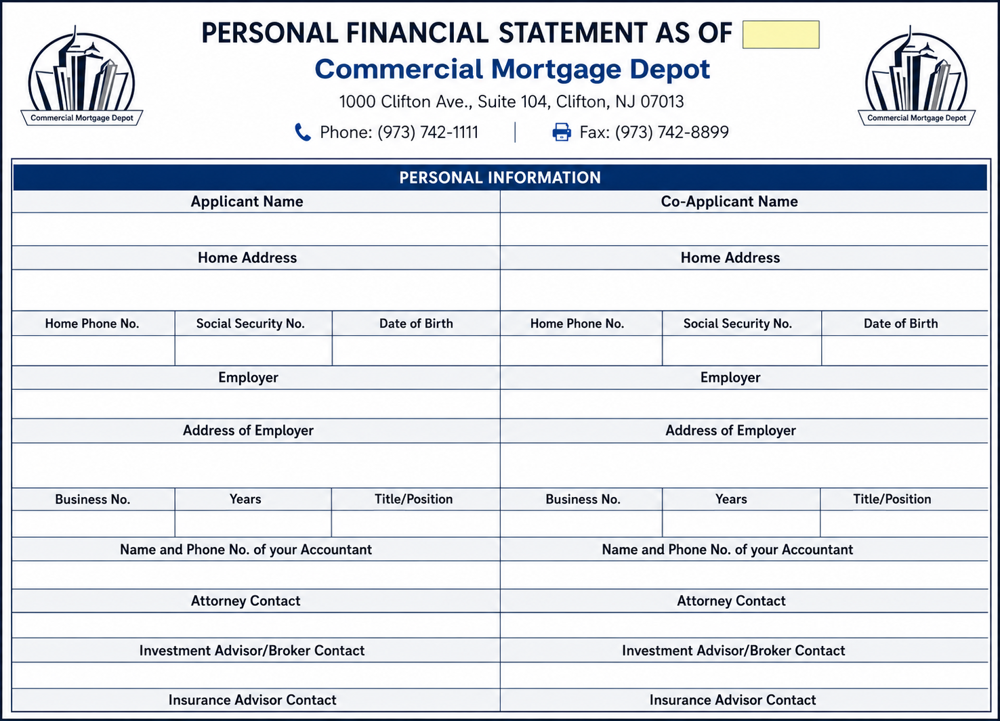
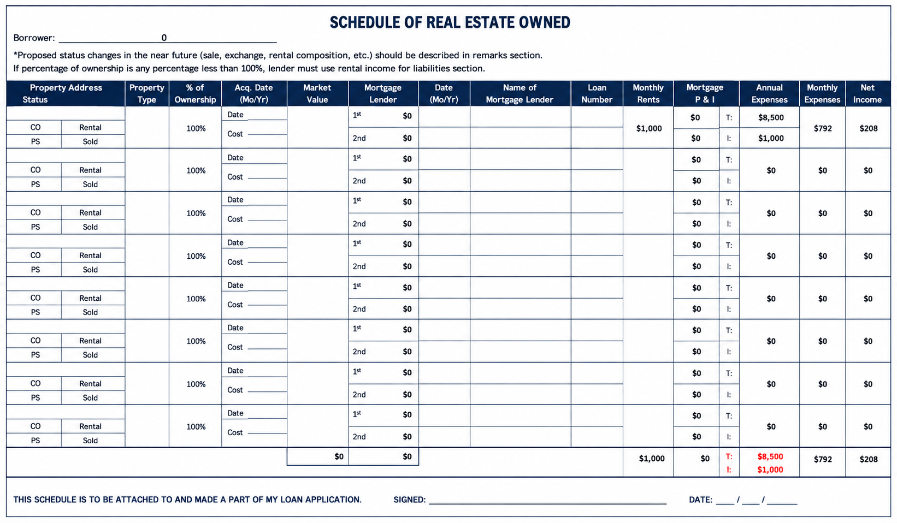

<h1 align="center">Personal Financial Statement (PFS) Preparation</h1>

<p align="center">
  
  
  
  
</p>

<p align="center"><strong>Commercial Mortgage Personal Financial Statement | Microsoft Excel</strong></p>

This project is a multi page Personal Financial Statement, the type of document a lender requires from a loan applicant before approving a commercial mortgage. It brings together personal information, income and expenses, assets and liabilities, and a full schedule of owned real estate, all linked together in one workbook.

This kind of work reflects real experience with financial data entry, organizing a multi tab spreadsheet, and keeping numbers consistent across several linked pages.

---

## What This Project Is About

A Personal Financial Statement gives a lender a full picture of an applicant's finances in one standardized document. Rather than one flat sheet, this workbook is built across seven connected pages, so a single number entered on one page updates related totals on another.

| Page | What It Covers |
|---|---|
| Page 1 | Personal information, contact details, and a summary of annual income and expenses |
| Page 2 | Balance sheet showing assets, liabilities, and net worth |
| Page 3 | Insurance details and a schedule of real estate holdings |
| Page 4 | Notes payable, background questions, and signature section |
| Page 6 (three copies) | A detailed schedule of real estate owned, covering rent, mortgage payments, and expenses for each property |

---

## Income and Expense Summary

| Item | Amount |
|---|---:|
| Rental Income | $31,980 |
| Total Annual Income | $31,980 |
| Residential Mortgage Payments | $16,376.76 |
| Investment Property Mortgage Payments | $96 |
| Property Taxes on Investment Property | $14,509 |
| Insurance Premiums | $2,018 |
| Total Annual Expenses | $32,999.76 |

These figures are calculated through formulas that pull from the supporting schedules on later pages, rather than being typed in directly on Page 1.

---

## Balance Sheet Summary

| Item | Amount |
|---|---:|
| Savings CD | $50 |
| Real Estate Investments | $200,000 |
| Total Assets | $200,050 |
| Notes Payable to Others | $10 |
| Total Liabilities | $10 |
| Net Worth | $200,040 |

The balance sheet confirms that total assets match total liabilities plus net worth, which is the standard check for accuracy on any financial statement.

---

## Schedule of Real Estate Owned

The workbook includes a detailed real estate schedule listing each property's rent, mortgage payment, expenses, and net income. Totals from three separate property pages roll up into one combined summary.

| Property Group | Market Value | Monthly Rent | Monthly Mortgage Payment | Monthly Expenses | Net Monthly Income |
|---|---:|---:|---:|---:|---:|
| Page 1 | $200,000 | $665 | $8 | $9.00 | $644 |
| Page 2 | $0 | $1,000 | $0 | $791.67 | $208.33 |
| Page 3 | $0 | $1,000 | $0 | $583.33 | $416.67 |
| Combined Total | $200,000 | $2,665 | $8 | $1,378.00 | $1,269.00 |

This schedule is what supports the rental income and expense figures shown earlier on Page 1.

---

## Sections Included in the Template

| Section | Purpose |
|---|---|
| Personal Information | Applicant and co-applicant contact and employment details |
| Income and Expenses | Full breakdown of yearly income sources and living expenses |
| Balance Sheet | Assets, liabilities, and net worth |
| Schedule A | Securities and investment holdings |
| Schedule B | Life and disability insurance details |
| Schedule C | Personal residence and investment property mortgage details |
| Schedule D | Partnership interests |
| Schedule E | Notes payable to other lenders |
| Schedule of Real Estate Owned | Full property by property income and expense detail |
| Background Questions | Bankruptcy history, pending legal actions, and related disclosures |
| Signatures | Applicant and co-applicant sign off |

Several personal fields, such as the applicant's name and Social Security number, were intentionally left blank in this sample, since the goal of this project was to test and demonstrate the structure and formulas, not to represent a real applicant.

---

## How the Numbers Were Calculated

The workbook is built so that entering data once on a supporting schedule automatically updates the summary pages. This avoids the risk of entering the same number twice and having it not match. Formulas were used to connect:

| Calculation | Where It Flows |
|---|---|
| Rental income from the real estate schedule | Feeds into Page 1 total income |
| Mortgage payments from the real estate schedule | Feeds into Page 1 total expenses |
| Property taxes and insurance from the real estate schedule | Feeds into Page 1 total expenses |
| Real estate investment values | Feeds into the Page 2 balance sheet |
| Total assets and total liabilities | Combine to calculate net worth |

---

## Tools and Skills Used

### Tools
- Microsoft Excel

### Skills
- Financial data entry
- Multi tab spreadsheet organization
- Linking formulas across sheets
- Balance sheet preparation
- Real estate income and expense tracking
- Attention to detail
- Working within a standardized lender template

---

## Project Preview

**Personal Financial Statement Overview**

This screenshot shows the personal information page along with the income and expense summary.



**Real Estate Owned Schedule**

This screenshot shows the detailed schedule of real estate owned, including rent, mortgage payments, and expenses for each property.



**Real Estate Schedule, Additional Pages**

These screenshots show the remaining real estate schedule pages that roll up into the combined totals.


---

## Files in This Project

```
personal-financial-statement/
│
├── README.md
├── Commercial-Mortgage-Personal-Financial-Statement.xlsx
│
└── Screenshots/
    ├── pfs-overview.png
    ├── real-estate-owned-schedule-1.png
    ├── Org_real-state-owned 1.png
    └── Org_real-state-owned 2.png
```

| File | What It Is |
|---|---|
| Commercial-Mortgage-Personal-Financial-Statement.xlsx | The full seven page workbook with all linked schedules and formulas |
| Screenshots folder | Images of the completed workbook, including the overview and the full real estate schedule |

---

## Why This Project Matters

Lenders rely on a Personal Financial Statement being accurate and internally consistent across every page. This project shows the ability to work carefully within a fixed, multi page format, keep numbers linked correctly through formulas, and organize detailed financial information the way a lender expects to see it. This is directly relevant to work in:

- Financial data entry
- Loan and mortgage documentation
- Multi sheet spreadsheet management
- Virtual assistant support for finance related tasks

---

## A Quick Note

This project was created for portfolio purposes only. The figures shown are part of a test template used to demonstrate the workbook's structure and formulas, and should not be treated as a real financial statement, loan application, or financial advice.

---

## About Me

**Kulsoom Mannan**
Data Analyst | Excel and Google Sheets Specialist | Virtual Assistant | Data Entry and Data Cleaning

<p align="left">
  <a href="mailto:kulsoom7799@gmail.com">
    
  </a>
  <a href="https://github.com/Kulsoom12377" target="_blank">
    
  </a>
</p>

More of my work is on my GitHub profile: https://github.com/kulsoomworkspace
